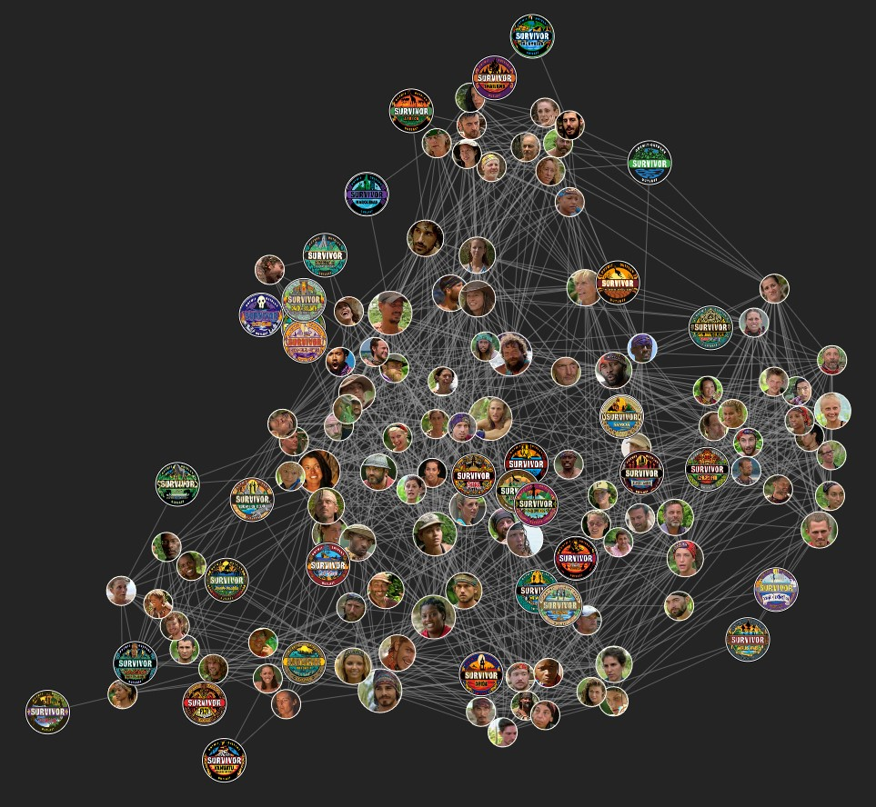
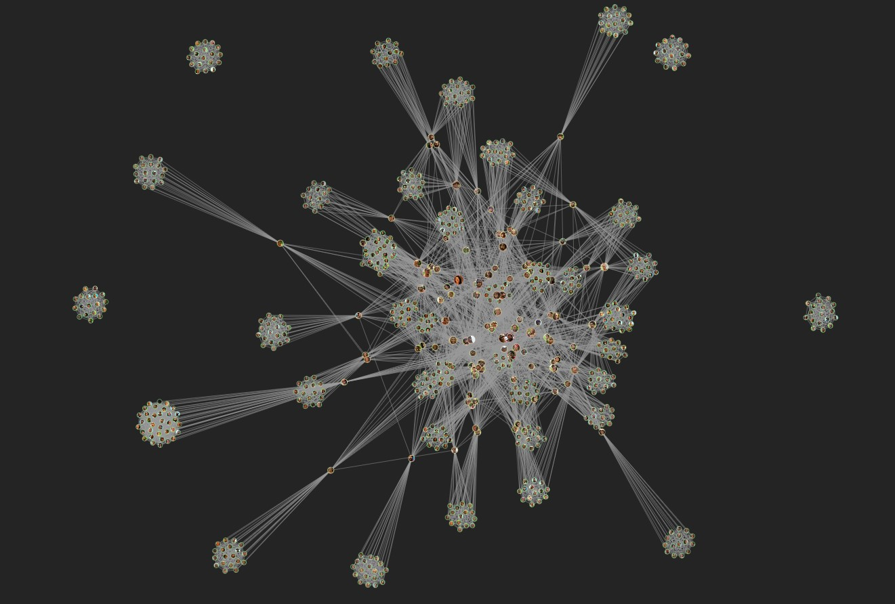
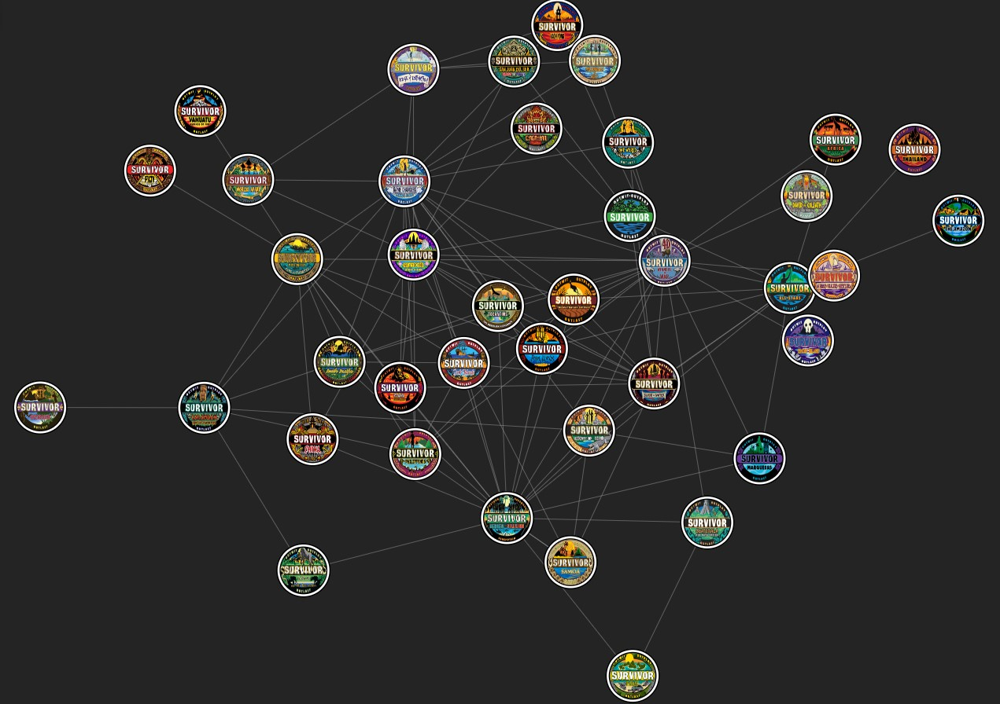

# Survivor Stats: Who's Connected to Who?

Ever wondered how Survivor contestants are connected across different seasons? This project visualizes and analyzes these connections!

## [👉 Try it out here!](https://hamburgj.github.io/survivor-stats) 

## What does it show?

When contestants play in the same season, they form a connection. Over 47+ seasons of Survivor, these connections create an interesting web of relationships. For example, Boston Rob played with Sandra in Heroes vs. Villains (Season 20), and then Sandra played with Ozzy in Game Changers (Season 34), creating a chain of connections.

Similar to the "Six Degrees of Kevin Bacon" concept, I analyzed the connections between all Survivor contestants, and found that any contestant from seasons 1-40 can be connected to any other contestant from those seasons in 5 or fewer steps (shared seasons).

### Notes
- To reduce clutter, single-season players are condensed into one node per season by default. You can still find paths to individual single-season players.
- Recent seasons (new era) appear as isolated "islands" since they haven't had any returning players yet.
- Data only includes US Survivor seasons.

### The Condensed View

The simplified network where each node represents either a multi-season player, or all single-season players a season. Multi-season players get their own colored nodes, making it easier to see how returning players connect different seasons together.

### The Full Network

Every single Survivor contestant shown as their own node. Much more cluttered, but shows the true scale of connections in the Survivor universe.

### Season Connections

A high-level view showing how seasons are connected through returning players. Each node is a season, and lines show when players returned in different seasons. The thickness of lines indicates how many players crossed between those seasons.

## Cool Findings

- The maximum distance between any two contestants from seasons 1-40 is 5 connections
- Key connecting players:
  - Brenda Lowe (Nicaragua, Caramoan) appears in over half of the longest connection chains
  - Boston Rob (Marquesas, All-Stars, Heroes vs. Villains, Redemption Island, Winners at War) is another major connector
- Season 21 (Nicaragua) players often end up at the ends of these longest chains